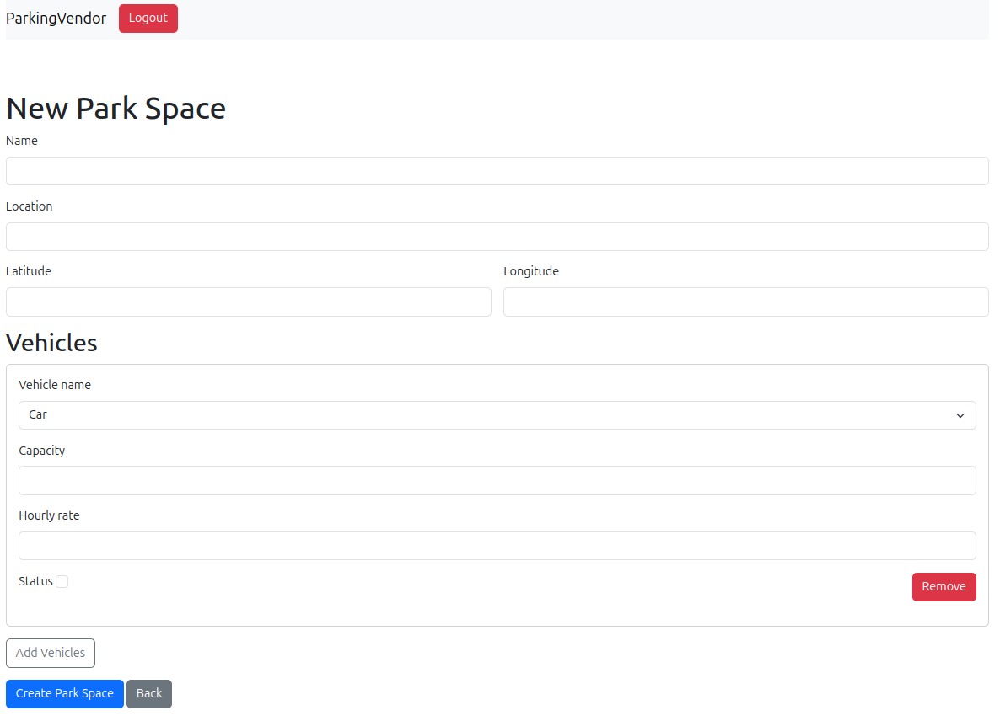

---

# Parking Management System

## Overview

The Parking Management System is a Ruby on Rails application developed during the Gurzu Hackday event. This system allows parking vendors to register, log in, and manage parking spaces. Vendors can dynamically add and remove vehicles, and manage vehicle parking and charges. The system also provides an API for mobile developers to find nearby parking spaces.

## Features

- **Vendor Registration and Login**: Vendors can register and log in to manage their parking spaces.
- **Create and Manage Parking Spaces**: Vendors can create parking spaces with details like name, location, latitude, and longitude.
- **Dynamic Vehicle Management**: Vendors can add and remove vehicles (car, bike, cycle, etc.) dynamically using nested forms.
- **Park Vehicle Tracking**: Track vehicles entering and leaving parking spaces, calculate costs based on hourly rates and duration.
- **API for Nearby Parking Spaces**: An API endpoint is available to find nearby parking spaces based on the location provided.

## Database Schema

### ParkSpaces Table

```ruby
create_table "park_spaces", force: :cascade do |t|
  t.string "name"
  t.string "location"
  t.bigint "user_id", null: false
  t.datetime "created_at", null: false
  t.datetime "updated_at", null: false
  t.float "latitude", null: false
  t.float "longitude", null: false
  t.index ["user_id"], name: "index_park_spaces_on_user_id"
end
```

### Vehicles Table

```ruby
create_table "vehicles", force: :cascade do |t|
  t.integer "vehicle_name"
  t.integer "capacity"
  t.integer "hourly_rate"
  t.boolean "status"
  t.bigint "park_space_id", null: false
  t.datetime "created_at", null: false
  t.datetime "updated_at", null: false
  t.integer "available", default: 0
  t.index ["park_space_id"], name: "index_vehicles_on_park_space_id"
end
```

### ParkVehicles Table

```ruby
create_table "park_vehicles", force: :cascade do |t|
  t.integer "vehicle_name"
  t.integer "hourly_rate"
  t.string "vehicle_number"
  t.datetime "starts_at"
  t.datetime "ends_at"
  t.integer "cost"
  t.bigint "park_space_id", null: false
  t.boolean "status"
  t.datetime "created_at", null: false
  t.datetime "updated_at", null: false
  t.index ["park_space_id"], name: "index_park_vehicles_on_park_space_id"
end
```

## API Documentation

### Get Nearby Park Spaces

- **Endpoint**: `/api/v1/park_spaces/:location`
- **Method**: `GET`
- **Parameters**:
  - `location` (required): The location to search for nearby parking spaces.
- **Response**:
  - Returns a JSON array of park spaces within a 10 km radius of the provided location, including details about available vehicles.

#### Example Request

```http
GET /api/v1/park_spaces/London
```

#### Example Response

```json
[
  {
    "id": 1,
    "name": "Central Park",
    "location": "London",
    "latitude": 51.5074,
    "longitude": -0.1278,
    "vehicles": [
      {
        "id": 1,
        "vehicle_name": "Car",
        "capacity": 4,
        "hourly_rate": 10,
        "status": true,
        "available": 2
      }
    ]
  }
]
```

## Technical Details

- **Geocoding**: Location coordinates are fetched using a geocoding service.
- **Distance Calculation**: Distance between locations is calculated using the Haversine formula.

## How to Run the Project

1. **Clone the Repository**:

   ```bash
   git clone <repository-url>
   cd <project-directory>
   ```

2. **Install Dependencies**:

   ```bash
   bundle install
   ```

3. **Setup the Database**:

   ```bash
   rails db:setup
   ```

4. **Run the Server**:

   ```bash
   rails server
   ```

5. **Access the Application**:

   Open your browser and go to `http://localhost:3000`.

---


